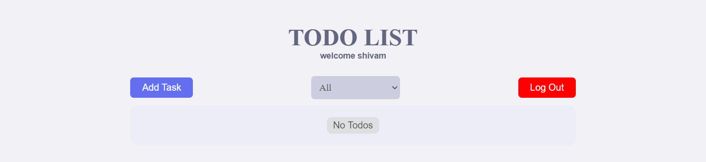
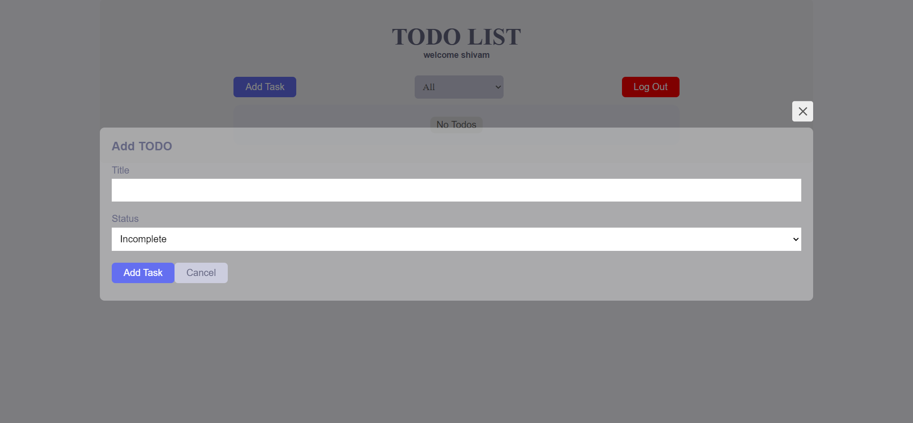
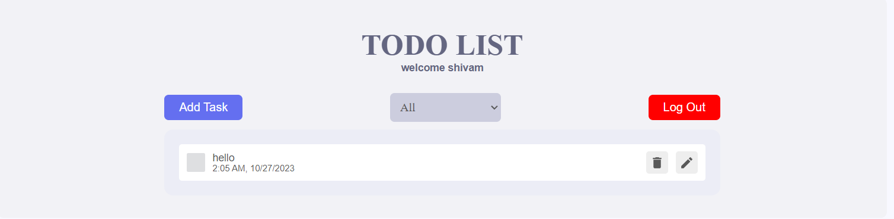
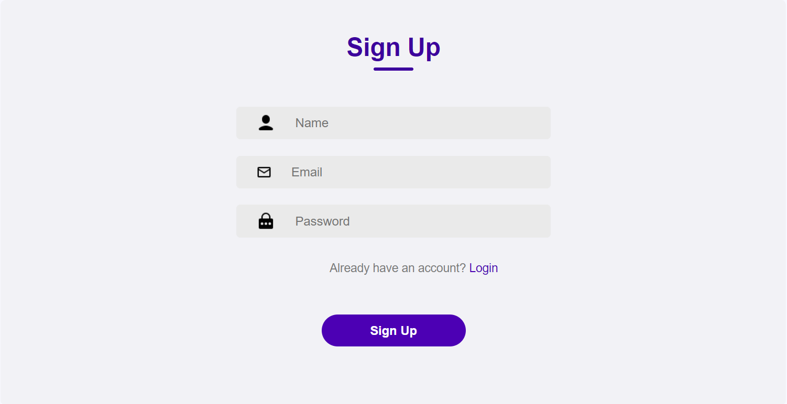
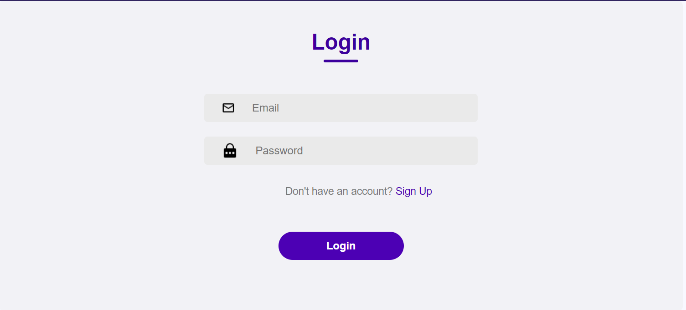

# Todo App

The Todo App is a simple web application built using React and Redux. It empowers users to manage their tasks efficiently. You can create, update, and delete tasks in your to-do list, filter tasks based on their status (complete or incomplete), and view your tasks sorted by their creation time.





## Table of Contents

- [Features](#features)
- [Getting Started](#getting-started)
- [Usage](#usage)
- [Screenshots](#screenshots)
- [Contributing](#contributing)
- [License](#license)

## Features

- **Task Management**: Create, update, and delete tasks with titles and statuses.
- **Status Tracking**: Easily mark tasks as complete or incomplete.
- **Filter Tasks**: Use filters to view tasks by status (All, Incomplete, or Complete).
- **Sorting**: Tasks are sorted based on their creation time.

## Getting Started

To start using the Todo App on your local machine, follow these steps:

1. Clone the repository to your local machine:

   ```bash
   git clone https://github.com/kumarshivu12/todo-app
   ```

2. Navigate to the project directory:

   ```bash
   cd todo-app
   ```

3. Install project dependencies:

   ```bash
   npm install
   ```

4. Start the development server:

   ```bash
   npm start
   ```

The application will be available at [http://localhost:3000](http://localhost:3000).

## Usage

To effectively manage your tasks with the Todo App, follow these usage guidelines:

1. Register or log in to your account.
2. Create new tasks by clicking on the "Add Task" button.
3. Update tasks by clicking on the edit icon.
4. Mark tasks as complete or incomplete by clicking the checkbox.
5. Delete tasks by clicking on the trash icon.
6. Filter tasks by their status (All, Incomplete, or Complete) using the dropdown.
7. Logout from your account when you're done.

## Screenshots




## Contributing

If you'd like to contribute to this project, please follow these steps:

1. Fork the repository on GitHub.
2. Create a new branch for your feature or bug fix:

   ```bash
   git checkout -b my-feature
   ```

3. Make your changes and commit them:

   ```bash
   git commit -m 'Add a new feature'
   ```

4. Push your changes to your fork:

   ```bash
   git push origin my-feature
   ```

5. Submit a pull request to the main repository.

## License

This project is licensed under the MIT License.

---

[Deployed Application](https://shivam-todo-app.netlify.app/)
